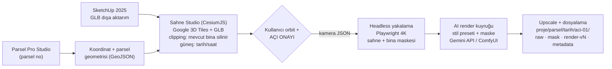

# Gerçek Çevre + AI Render Otomasyonu — Teknoloji Araştırması ve Yol Haritası

> **Fikir:** Parsel Pro Studio'daki parsel koordinatlarını kullanarak kameranın otomatik olarak arsaya gitmesi, SketchUp modelinin gerçek çevrenin (Google 3D şehir dokusu) içine oturtulması, kullanıcının açıyı onaylaması ve onaylanan karenin otomatik olarak AI ile foto-gerçekçi render edilip proje klasörüne kaydedilmesi.
>
> **Sonuç:** Bu fikir bugünkü teknolojiyle **uçtan uca otomatikleştirilebilir.** Google Earth Pro'nun kendisi otomasyona kapalı; ancak Google, aynı 3D şehir verisini **Photorealistic 3D Tiles API** olarak dışarı açıyor ve bu veri CesiumJS / D5 Render / Unreal Engine içinde programatik olarak kullanılabiliyor. Eksik olan tek şey bu parçaları birleştiren uygulama — o da bu yol haritasının konusu.

*Hazırlanma tarihi: 27 Ağustos 2026*

---

## 1. Fikrin doğrulanması — neden çalışır?

AI'ya çevre "uydurtmak" yerine **gerçek çevreyi zemin olarak kullanmak** doğru yaklaşım; sektörde bu yönteme geçen ürünler var (ör. Palatial, Cesium + Google 3D Tiles ile tam olarak bunu yapıyor). Zincirin her halkası bugün hazır:

| Halka | Çözüm | Durum |
|---|---|---|
| Parsel koordinatı | Parsel Pro Studio (TKGM verisi, EPSG:4326 geometri) | ✅ Elinizde var |
| Gerçek 3D çevre | Google **Photorealistic 3D Tiles** (Map Tiles API) — Google Earth'teki fotogerçekçi şehir dokusunun API hali | ✅ 2.500+ şehir, 49 ülke |
| Modeli sahneye koyma | SketchUp **2025 doğal GLB dışa aktarımı** → CesiumJS sahnesine koordinatla yerleştirme | ✅ Doğal destek |
| Parseldeki mevcut binayı silme | CesiumJS **Clipping Polygons** (v1.117+) — parsel poligonuyla dokudan oyuk açma; Cesium'un resmi eğitimi tam bu senaryo için | ✅ Resmi destek |
| Açı seçimi + onay | Web tabanlı görüntüleyici (tarayıcıda serbest orbit) + kamera durumunu JSON kaydetme | ✅ Standart teknik |
| Otomatik yüksek çözünürlük yakalama | Playwright/Puppeteer headless Chromium — onaylanan kamera JSON'u ile aynı kareyi 4K yakalama | ✅ Standart teknik |
| AI foto-gerçekçi render | Gemini 2.5 Flash Image (Nano Banana) API / ComfyUI + Flux/SDXL + ControlNet | ✅ API ile tam otomasyon |
| Dosyalama | Proje klasör yapısı + metadata.json (+ istenirse Google Drive) | ✅ Basit |

**Kritik içgörü:** AI render adımında en iyi sonucu almak için sahneden **iki kare** alınır: (1) tam sahne, (2) sadece binanın siluet maskesi (çevre dokusu gizlenmiş halde). AI'ya "arka plana dokunma, sadece binayı foto-gerçekçi hale getir ve ışığı uyumla" derken maske verilir. Böylece gerçek çevre **piksel piksel korunur**, uydurma ortadan kalkar; AI sadece sizin binanızı ve genel ışık uyumunu işler.

---

## 2. Teknoloji envanteri (araştırma bulguları)

### 2.1 Zemin veri: Google Photorealistic 3D Tiles

- Google Earth'teki fotogerçekçi 3D şehir dokusunun resmî API'si (Map Tiles API içinde). OGC 3D Tiles standardında servis edilir; CesiumJS, Cesium for Unreal/Unity, deck.gl, ArcGIS ve **D5 Render** tarafından desteklenir.
- **Fiyat:** ~**6 $ / 1.000 oturum** (kademeli düşer), ayda **1.000 oturum ücretsiz**. Bir "oturum" = bir root tileset isteği; kullanıcı 3 saatlik pencere içinde istediği kadar gezinir, tek oturum sayılır. Pratikte bir mimarlık ofisi için maliyet **sıfıra yakın** (günde 30 sahne açsanız bile ücretsiz kotanın civarındasınız).
- **Kapsama:** 2.500+ şehir. Türkiye'de Google Earth'te 3D dokusu görünen şehirler (İstanbul, Ankara, İzmir vb.) kapsamdadır; **Faz 0'da kendi çalıştığınız ilçelerin koordinatlarıyla kapsama testi yapılmalı** (kapsam dışıysa yedek plan §6'da).
- **Erişim:** Google Cloud projesi + Map Tiles API anahtarı. CesiumJS'te tek satır: `createGooglePhotorealistic3DTileset()`.

### 2.2 Google Earth ailesi — neden Faz 0 için ideal, otomasyon için değil

| Araç | Model koyma | Otomasyon | Not |
|---|---|---|---|
| **Google Earth Pro (masaüstü)** | ✅ SketchUp'tan KMZ/DAE (Add Location ile coğrafi konumlu) | ❌ Resmî API yok; ancak KML dosyası programatik üretilebilir (kamera açıları `<Camera>`/`<LookAt>`, turlar `<gx:Tour>`) | "Save Image" ile ~4800 px görüntü. Elle hızlı kavram kanıtı için birebir |
| **Google Earth (web) — yeni** | ✅ **Deneysel GLB içe aktarma** (2025+): projeye doğrudan GLB model eklenebiliyor | ❌ API yok | Sadece GLB; harici doku referansı desteklenmiyor (dokular GLB içine gömülü olmalı); metalik malzemede bilinen hata var. Fikrinizin Google tarafındaki resmî karşılığı — elle kullanım için güzel |
| **Google Earth Studio** | ❌ Özel model render etmez | ✅ Keyframe kamera + görüntü dizisi render | **After Effects'e 3D kamera + track point dışa aktarımı** var → animasyonda modelinizi ayrı render edip Earth görüntüsünün üzerine kamera-uyumlu bindirme (ileri seviye video tekniği, Faz 4) |

**Karar:** Google Earth ürünleri betiklenebilir olmadığı için otomasyon hattı **Cesium tabanlı** kurulur; Google Earth Pro/web Faz 0'da fikri sıfır kodla kanıtlamak için kullanılır.

### 2.3 Model hattı: SketchUp → sahne

- **SketchUp 2025, GLB/glTF'yi PBR malzeme desteğiyle doğal olarak dışa aktarıyor** (File → Export → 3D Model → `.glb`). Eski sürüm kullanılıyorsa: DAE/OBJ dışa aktar → Blender headless (`blender -b -P convert.py`) ile GLB'ye çevir — bu adım da otomatikleştirilebilir.
- Yerleştirme için gerekenler: parsel merkez koordinatı (Parsel Pro'dan hazır), zemin kotu (Cesium'da doku üzerinden `clampToHeightMostDetailed` ile örneklenir) ve bina yönü (heading — parsel cephesinden otomatik önerilir, kullanıcı ince ayar yapar).
- Google Earth Pro hattı için: SketchUp'ta **Add Location** ile coğrafi referans + KMZ dışa aktarım yeterli.

### 2.4 Sahne motorları — üç seviye

1. **CesiumJS (web) — otomasyonun omurgası.** Açık kaynak, tarayıcıda çalışır, Google 3D Tiles'ı doğrudan yükler, GLB modeli koordinata koyar, **clipping polygon ile parseldeki mevcut binayı dokudan siler** (v1.117+, resmî eğitim: tasarım modelini Google dokusunun içine gömme). Güneş konumu tarih/saate göre simüle edilir → gölge yönü gerçek. Headless yakalamaya uygun.
2. **D5 Render 3.0+ — kodsuz profesyonel ara çözüm.** SketchUp ile canlı senkron çalışan, Türkiye'de çok yaygın render motoru; **Cesium entegrasyonu sayesinde Google Photorealistic 3D Tiles şehir dokusunu tek tıkla sahneye alıyor**, section cube ile parseldeki mevcut doku kesilip yerine model konuyor, gerçek zamanlı ışık/atmosfer + kendi AI araçlarıyla render alınıyor. Otomasyon yazılana kadar (ve sonrasında en yüksek kalite kareler için) üretimde hemen kullanılabilir.
3. **Unreal Engine 5 + Cesium for Unreal — sinematik üst seviye.** Lumen ışık, Movie Render Queue ile 8K kare/animasyon; SketchUp'tan Datasmith ile aktarım. Mimari iletişimde bu kombinasyonu kullanan ticari ürünler mevcut (Palatial). Öğrenme eğrisi yüksek → Faz 4.

### 2.5 AI render katmanı — "son teknoloji" durumu

| Araç | Tür | Otomasyon | Güçlü yanı |
|---|---|---|---|
| **Gemini 2.5 Flash Image ("Nano Banana")** | Bulut API | ✅ Tam (REST API) | Doğal dille yerel düzenleme; geometriyi ve arka planı koruyarak foto-gerçekçilik; ~0,04 $/görsel. Üst modeli **Nano Banana Pro (Gemini 3 Pro Image)** 2K/4K çıktı verir |
| **ComfyUI + Flux / SDXL + ControlNet (depth/canny) + inpaint** | Yerel GPU (veya kiralık) | ✅ Tam (HTTP/WebSocket API) | Tam kontrol, sabit stil presetleri, maskeyle sadece binayı işleme, sınırsız/ücretsiz üretim; tekrarlanabilir sonuç |
| **Veras (EvolveLAB)** | SketchUp eklentisi | Kısmî | ControlNet tabanlı, geometriye sadık; SketchUp içinden pratik |
| **SketchUp Diffusion** | SketchUp yerleşik | Kısmî | Hızlı konsept |
| **D5 Render AI (enhancer/atmosphere)** | D5 içinde | Kısmî | D5 hattında entegre |
| **Magnific / Krea / SUPIR (yerel)** | Upscale/detay | ✅ (API/yerel) | Son kare 4K+ netleştirme |

**Önerilen strateji:** Faz 3'te **Gemini API ile başla** (sıfır altyapı, dakikada devrede), hacim artınca **ComfyUI'yi yerel GPU'da** devreye al (stil tutarlılığı + maliyet sıfırlama). İkisi aynı kuyruk mimarisinin arkasında değiştirilebilir "render sağlayıcısı" olarak tasarlanır.

### 2.6 Yakalama otomasyonu

- Onay ekranındaki kamera durumu (konum, heading, pitch, FOV, güneş saati) JSON olarak kaydedilir.
- Sunucuda **Playwright (headless Chromium)** aynı sahneyi aynı kamera JSON'u ile açar, doku yüklenmesinin bitmesini bekler (`tileLoadProgressEvent == 0`), **3840×2160+ çözünürlükte** kare alır → onay ekranında görülenle piksel-piksel aynı kadraj.
- Çift geçiş: (1) tam sahne JPG, (2) doku gizlenip yalnız model — alfa kanalından **bina maskesi** PNG. Maske, AI adımında arka planı kilitler.

---

## 3. Hedef mimari



Klasör yapısı önerisi:

```
projeler/
└── 1234-ada-5-parsel/
    └── 2026-08-27/
        ├── aci-01/
        │   ├── raw.jpg            # Cesium'dan çıkan gerçek-çevre karesi
        │   ├── mask.png           # bina siluet maskesi
        │   ├── render-gunduz-v1.jpg
        │   ├── render-aksam-v1.jpg
        │   └── metadata.json      # kamera, güneş saati, stil, model sürümü
        └── aci-02/ ...
```

---

## 4. Yol haritası

### Faz 0 — Kavram kanıtı, sıfır kod (bu hafta, ~1 gün)
1. SketchUp'ta modele **Add Location** ile gerçek konum ver → **KMZ** dışa aktar → **Google Earth Pro**'da aç; ayrıca **GLB** dışa aktarıp **Google Earth web**'in deneysel model içe aktarmasını dene.
2. Beğendiğin açıdan yüksek çözünürlük görüntü al (GE Pro "Save Image").
3. Görüntüyü **Gemini (Nano Banana)** ile işle: *"Binayı foto-gerçekçi hale getir; geometriyi, kadrajı ve çevreyi aynen koru; ışığı çevreyle uyumla."*
4. Kendi çalıştığın bölgelerin koordinatlarında **Photorealistic 3D Tiles kapsama testi** yap.
- **Çıktı / kabul:** "Gerçek çevre + AI render" kalitesinin müşteriye gösterilebilir olduğunun kanıtı; kapsama raporu. Bu faz aynı zamanda stil promptlarının ilk kütüphanesini üretir.

### Faz 1 — Kodsuz üretim hattı: D5 Render (1–2 hafta, öğrenme dahil)
1. D5 Render 3.0+ kur; SketchUp canlı senkron bağla.
2. Cesium/GIS panelinden parsel koordinatına git, **Google 3D Tiles şehir dokusunu sahneye al**; section cube ile parseldeki mevcut dokuyu kes, modeli oturt.
3. Gerçek güneş/atmosfer ayarla; yüksek kalite kareler + D5 AI enhancer.
- **Çıktı / kabul:** Otomasyon beklemeden bugün müşteri işlerinde kullanılabilen, gerçek çevreli render süreci. (Bu hat kalıcı olarak "en yüksek kalite manuel kare" seçeneği olarak da kalır.)

### Faz 2 — "Sahne Studio" web uygulaması MVP (2–4 hafta)
1. CesiumJS görüntüleyici: Google 3D Tiles + GLB yükleme (sürükle-bırak).
2. **Parsel Pro Studio entegrasyonu:** parsel seçilince kamera otomatik parsele uçar; parsel poligonu **clipping** olarak uygulanır (mevcut bina silinir); model parsel merkezine, zemin kotu örneklenerek konur; heading kaydırıcısı.
3. Kamera presetleri (kuş bakışı 45°, insan gözü sokak, cephe dik açıları) + serbest orbit + güneş saati kaydırıcısı.
4. **"Bu açıyı onayla"** → kamera JSON listeye eklenir; "JPG indir" (manuel AI render ile köprü dönem).
- **Çıktı / kabul:** Parsel no girip 2 dakika içinde modelin gerçek çevrede durduğu, açı koleksiyonu yapılabilen web aracı.

### Faz 3 — Tam otomasyon: onay → render → klasör (3–4 hafta)
1. **Headless yakalama servisi:** Playwright ile onaylı her açının 4K sahne + maske karesi.
2. **AI render kuyruğu:** stil presetleri (gündüz fotoğrafik / akşam / gece / yağmur / kış / eskiz...), maske ile arka plan koruma; sağlayıcı: Gemini API (başlangıç) → ComfyUI + Flux ControlNet (ölçek). Her stil için 2–3 varyant.
3. **Upscale** (4K+) ve otomatik **dosyalama + metadata**; istenirse Google Drive'a yükleme.
4. Onay panelinde ham kare ↔ render karşılaştırma, "yeniden üret / stili değiştir" düğmeleri.
- **Çıktı / kabul:** *Parsel seç → açıları onayla → kahveni al → klasörde stillere göre adlandırılmış renderlar.* Hedef süre: onaydan sonra açı başına < 2 dakika.

### Faz 4 — Üst seviye (opsiyonel, sürekli iyileştirme)
- **UE5 + Cesium for Unreal + Datasmith:** sinematik kareler ve animasyon; Movie Render Queue.
- **Google Earth Studio + After Effects kamera dışa aktarımı:** Earth üzerinden uçuş videolarına modelin kamera-uyumlu bindirilmesi.
- **Drone fotogrametri / 3D Gaussian Splatting** (RealityScan, Postshot, Luma): yakın çevrenin kendi çekimlerinizle santimetre hassasiyetinde modellenmesi — hem kalite hem lisans açısından en güçlü zemin; kapsama dışı bölgelerin de çözümü.
- Müşteri portalı: onaylı açıların/renderların paylaşılabilir galerisi.

---

## 5. Maliyet özeti

| Kalem | Maliyet |
|---|---|
| Google Photorealistic 3D Tiles | ~6 $/1.000 oturum; ayda 1.000 oturum ücretsiz → ofis ölçeğinde **≈ 0 ₺** |
| Gemini 2.5 Flash Image API | ~0,04 $/görsel (Nano Banana Pro daha yüksek) |
| ComfyUI (yerel) | Ücretsiz; GPU: eldeki RTX (12 GB+ VRAM önerilir) veya kiralık ~0,3–0,7 $/saat |
| D5 Render | Community ücretsiz; Pro abonelik (AI ve bazı GIS özellikleri için) |
| SketchUp 2025, Playwright, CesiumJS | Mevcut lisans / açık kaynak |
| Geliştirme | Faz 2+3 ≈ 5–8 hafta iş |

---

## 6. Riskler ve dikkat edilecekler

1. **Kapsama:** Parsel, Google 3D dokusu dışında kalabilir (küçük ilçeler). Yedek plan: Cesium World Terrain + yüksek çözünürlük uydu drape (çevre binalar hariç gerçek zemin) veya drone fotogrametri. Faz 0'daki kapsama testi bu riski erkenden netleştirir.
2. **Lisans/atıf:** Google 3D Tiles kullanımında **Google logosu + veri sağlayıcı atıfları görüntüde görünür kalmalı** (Cesium bunu otomatik basar; kareyi kırpma/silme yok). İçerik önbelleklenip saklanamaz (oturum içi kullanım serbest). Görüntülerin AI ile türev işlenmesi ToS açısından gri alan — maske yaklaşımı (arka plan piksellerinin aynen korunması, yalnız kendi binanızın işlenmesi) hem kaliteyi hem uyumu güçlendirir; müşteri teslimlerinde atıf satırını koruyun. Tam hukuki rahatlık istenirse çevre verisi kendi drone çekiminizden üretilir (Faz 4).
3. **Doku kalitesi:** Fotogerçekçi doku "drone mesafesinde" (50–300 m) mükemmel, sokak seviyesinde yumuşar. En etkili açılar 30–45° kuş bakışı ve orta mesafe cephe açılarıdır; sokak-gözü kareler için AI uyumlama daha fazla iş yapar (ya da Faz 4 drone verisi).
4. **Işık uyumu:** Google dokusunun gölgeleri çekim günündeki güneşle "pişmiş" durumda; modelin gölgesi Cesium güneşinden gelir. Küçük uyumsuzlukları AI harmonizasyon adımı kapatır; büyük sahnelerde güneş saatini dokunun gölge yönüne yakın seçmek en temiz sonucu verir.
5. **Google Earth Pro otomasyonu beklentisi:** GE Pro'nun API'si yok; oradaki akış her zaman yarı-manuel kalır. Otomasyonun tamamı Cesium hattında kurulur — GE Pro yalnız Faz 0/hızlı kontrol aracıdır.

---

## 7. Kaynaklar

- Photorealistic 3D Tiles genel bakış — https://developers.google.com/maps/documentation/tile/3d-tiles-overview
- Map Tiles API kullanım ve faturalama — https://developers.google.com/maps/documentation/tile/usage-and-billing
- Map Tiles API politikaları (atıf kuralları) — https://developers.google.com/maps/documentation/tile/policies
- Fotogerçekçi 3D kapsama haritası — https://developers.google.com/maps/documentation/javascript/3d/coverage
- CesiumJS Clipping Polygons eğitimi (tasarım modelini Google dokusuna gömme) — https://cesium.com/learn/cesiumjs-learn/cesiumjs-clipping-polygons/
- Cesium + Google 3D Tiles — https://cesium.com/learn/photorealistic-3d-tiles-learn/
- Palatial vaka çalışması (mimari iletişim) — https://cesium.com/blog/2023/06/27/palatial-uses-google-photorealistic-3d-tiles-and-cesium-for-unreal-for-architectural-communication/
- Google Earth (web) deneysel 3D model içe aktarma — https://developers.google.com/maps/documentation/earth/import-3d-models
- Google Earth Studio 3D kamera dışa aktarımı — https://earth.google.com/studio/docs/advanced-features/3d-camera-export/
- SketchUp glTF/GLB desteği — https://help.sketchup.com/en/sketchup/working-gltf-files
- D5 Render Cesium/GIS kullanımı — https://docs.d5render.com/user-guide/tool/how-to-use-cesium
- Gemini 2.5 Flash Image (Nano Banana) — https://ai.google.dev/gemini-api/docs/models/gemini-2.5-flash-image
- Cesium for Unreal + Google 3D Tiles — https://cesium.com/learn/unreal/unreal-photorealistic-3d-tiles/
